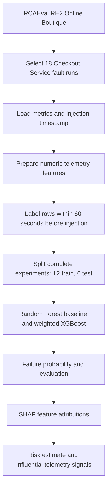
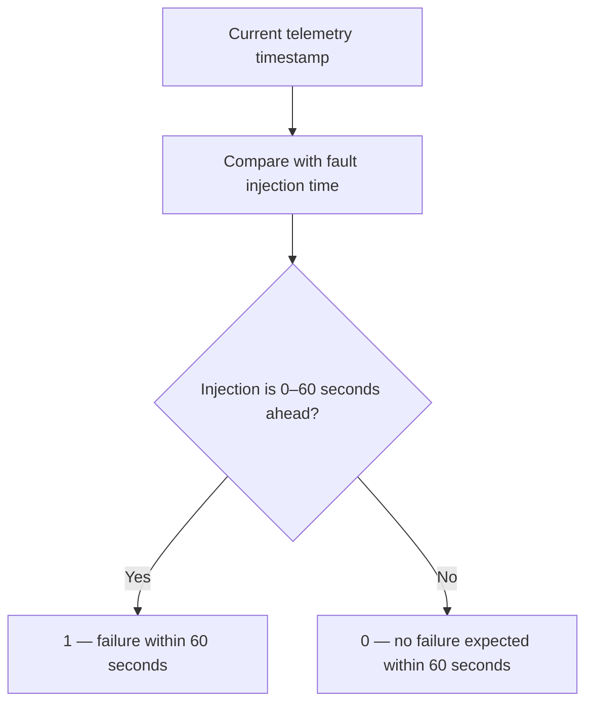
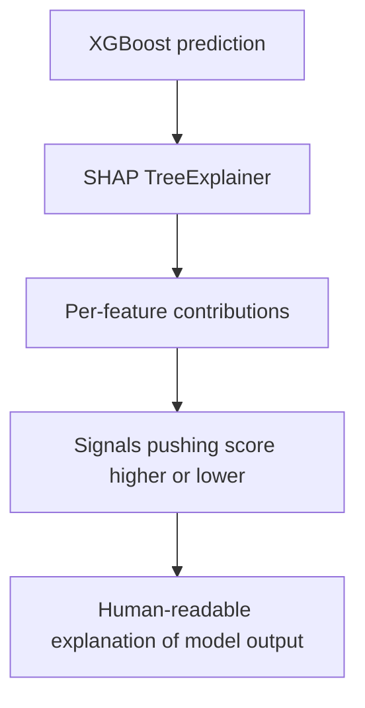
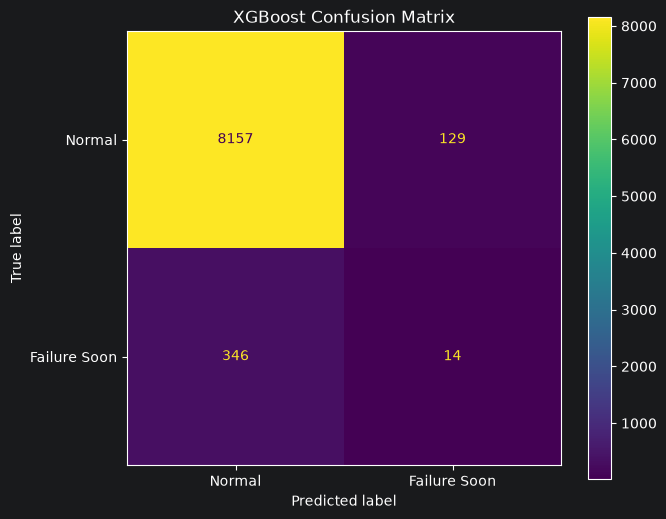
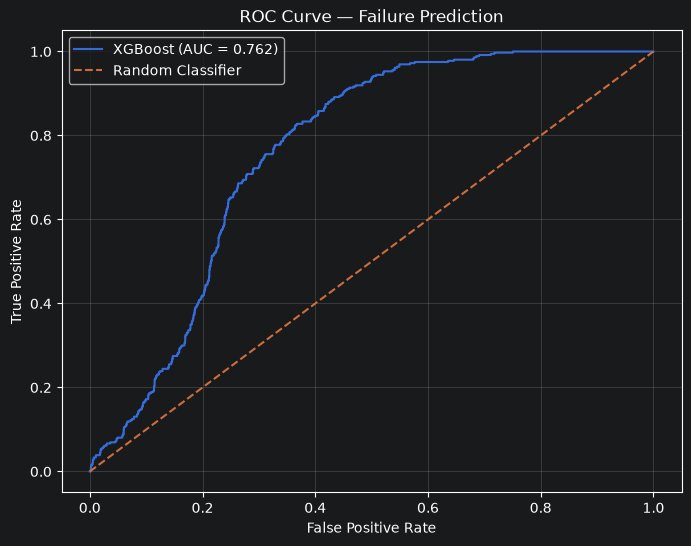
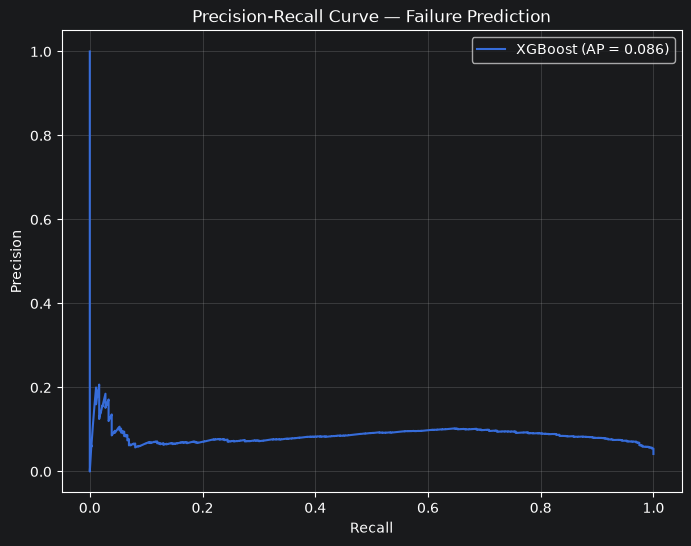
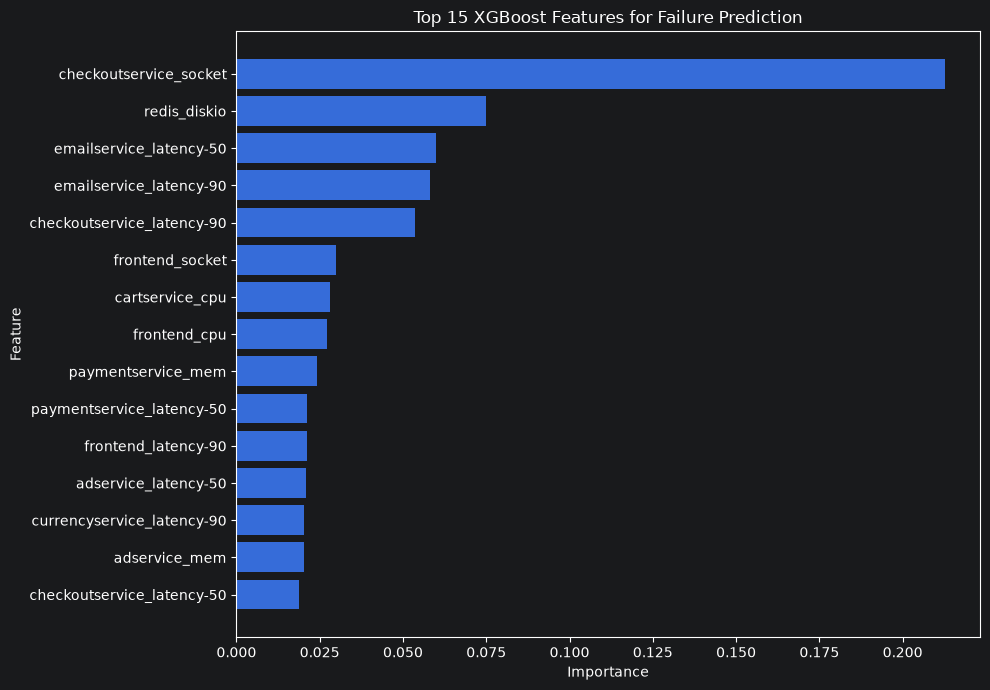
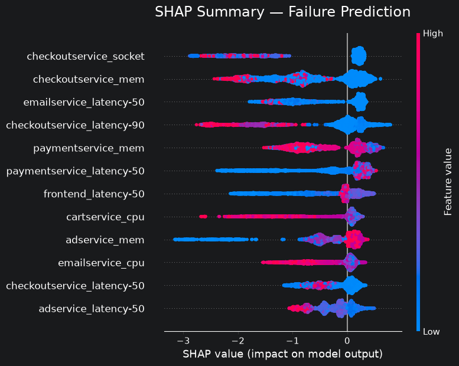
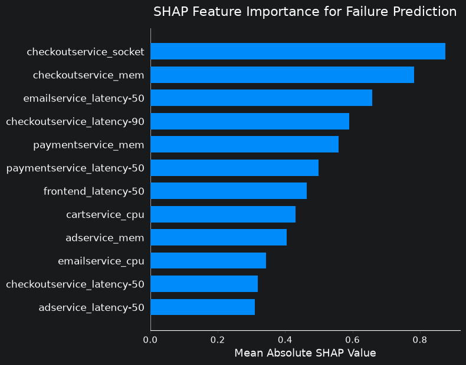

# Explainable API Failure Prediction in Microservice Architectures

An academic prototype for estimating whether a fault injection is approaching in a microservice system, using telemetry available before the injection and explaining model predictions with SHAP.

[](https://www.python.org/)
[](https://jupyter.org/)
[](https://xgboost.readthedocs.io/)
[](https://shap.readthedocs.io/)

> **Scope:** The current notebook is an offline experiment on RCAEval's RE2 Online Boutique Checkout Service fault runs. It predicts a label derived from the known fault-injection time; it is not a live outage prediction or alerting service.

## Table of contents

- [Overview](#overview)
- [How it works](#how-it-works)
- [Dataset](#dataset)
- [Target and evaluation split](#target-and-evaluation-split)
- [Models and results](#models-and-results)
- [Feature importance and SHAP](#feature-importance-and-shap)
- [Visualizations](#visualizations)
- [Repository structure](#repository-structure)
- [Setup and usage](#setup-and-usage)
- [Limitations](#limitations)
- [Future work](#future-work)
- [Research context](#research-context)
- [References](#references)
- [Author](#author)

## Overview

Microservice applications are composed of independently running services that communicate to deliver an application. In an online store, for example, frontend, checkout, cart, payment, email, and Redis services may all participate in a request. A slowdown or fault in one component can affect other services, so telemetry from multiple services can help describe the system's condition.

Traditional monitoring often identifies a problem after an error or threshold breach. This project explores an early-warning workflow: learn patterns in metrics, estimate the probability that a fault injection will occur within a 60-second horizon, and inspect which input signals influenced that estimate. The experiments focus on the Checkout Service, while selected model inputs include metrics associated with other services as well.

## How it works



The dataset also contains logs and traces, but the current notebook loads `metrics.parquet` for model inputs. It does not combine logs or traces into the model.

## Dataset

The data source is **RCAEval RE2 / Online Boutique**. This project selects 18 Checkout Service experiments: three runs each for CPU, delay, disk, packet loss, memory, and socket faults.

| File | Contents and use in this project |
|---|---|
| `metrics.parquet` | Time-series metrics from multiple services; this is the file used to construct model rows. |
| `logs.parquet` | Service/container log records; present in the benchmark, not used as model inputs in the current notebook. |
| `traces.parquet` | Distributed trace and span information (for example, trace/span IDs, service and operation names, duration, status); not used as model inputs in the current notebook. |
| `inject_time.txt` | Fault injection timestamp, used to generate the early-warning target. |

The notebook concatenates the selected metrics into **24,990 rows and 90 columns before target creation**. It then adds the target column, `failure_within_60s`. Across the labeled data there are 1,080 positive and 23,910 negative samples.

> **Feature-count note:** The project brief lists 69 model features, but the checked-in notebook currently selects and trains on **85 numeric features** (`len(feature_columns)` and the final summary both report 85). This README follows the executable notebook. The 69-versus-85 discrepancy should be reconciled if 69 is the intended feature set.

### Fault experiments

```text
re2ob_checkoutservice_{cpu,delay,disk,loss,mem,socket}_{1,2,3}
```

### Dataset sources

- [RCAEval on Hugging Face](https://huggingface.co/datasets/phamquiluan/RCAEval)
- [Official RCAEval repository](https://github.com/phamquiluan/RCAEval)
- [RCAEval on Zenodo](https://zenodo.org/records/14590730)

The raw benchmark is not part of this repository. Download and extract the dataset locally under `data/raw/rcaeval/`, preserving each experiment folder and its files. The notebook filters for the 18 `re2ob_checkoutservice_*` directories.

## Target and evaluation split

The binary target is derived from each row's telemetry timestamp and that experiment's injection timestamp. A row is positive when it occurs before injection and no more than 60 seconds before it:



This turns the fault experiments into a supervised early-warning classification task. It predicts proximity to the recorded injection, not arbitrary naturally occurring outages.

### Experiment-level split

The notebook holds out the third run of every fault type as test data and uses the other two runs for training. Splitting entire experiments keeps temporally correlated rows from the same run from appearing in both train and test sets, reducing an important source of leakage.

| Partition | Experiments | Rows | Normal | Failure |
|---|---:|---:|---:|---:|
| Training | 12 | 16,344 | 15,624 | 720 |
| Test | 6 | 8,646 | 8,286 | 360 |
| Total | 18 | 24,990 | 23,910 | 1,080 |

**Test experiments:** `re2ob_checkoutservice_cpu_3`, `re2ob_checkoutservice_delay_3`, `re2ob_checkoutservice_disk_3`, `re2ob_checkoutservice_loss_3`, `re2ob_checkoutservice_mem_3`, and `re2ob_checkoutservice_socket_3`.

## Models and results

The notebook evaluates a class-weighted Random Forest baseline and an XGBoost classifier. XGBoost is a gradient-boosted tree method suited to structured telemetry tables, where feature interactions and nonlinear decision boundaries can be useful. To account for the rare positive class, the notebook sets `scale_pos_weight` to the training negative-to-positive ratio: 15,624 / 720 ≈ **21.7**. This weighting helps emphasize failure examples during training; it does not balance the dataset or remove the resulting precision/recall trade-off.

### Configuration

| Model | Configuration |
|---|---|
| Random Forest baseline | `n_estimators=300`, `max_depth=None`, `min_samples_leaf=2`, `class_weight="balanced"`, `random_state=42`, `n_jobs=-1` |
| XGBoost primary model | `n_estimators=300`, `max_depth=5`, `learning_rate=0.05`, `subsample=0.8`, `colsample_bytree=0.8`, `scale_pos_weight≈21.7`, `eval_metric="logloss"`, `random_state=42`, `n_jobs=-1` |

### Held-out results

| Model / operating point | ROC-AUC | Average Precision | Precision | Recall | F1 |
|---|---:|---:|---:|---:|---:|
| Random Forest, default classifier threshold | 0.7495 | — | 0.000 | 0.000 | 0.000 |
| XGBoost, probability threshold 0.50 | 0.7617 | 0.0864 | 0.098 | 0.039 | 0.056 |

For XGBoost at threshold 0.50, the test confusion matrix is **TN 8,157; FP 129; FN 346; TP 14** across 8,646 samples, including 360 positive samples.

ROC-AUC measures ranking across thresholds, but can look moderate even when a model retrieves few positives at a particular operating point. With only 360 positives among 8,646 test samples, precision-recall behavior is especially important. Average Precision (0.0864) summarizes precision across recall levels and should be interpreted alongside the positive prevalence and threshold-specific precision/recall; it is not a claim of strong operational alert quality.

### Experimental threshold analysis

The following values are measured on the held-out test set at the listed probability cutoffs:

| Threshold | Precision | Recall | F1 |
|---:|---:|---:|---:|
| 0.50 | 0.098 | 0.039 | 0.056 |
| 0.40 | 0.093 | 0.056 | 0.069 |
| 0.30 | 0.078 | 0.067 | 0.072 |
| 0.20 | 0.066 | 0.081 | 0.073 |
| 0.15 | 0.069 | 0.108 | 0.085 |
| 0.10 | 0.066 | 0.139 | 0.089 |
| 0.05 | 0.076 | 0.231 | 0.115 |

Among these tested cutoffs, 0.05 has the highest observed F1 (0.115), with precision 0.076 and recall 0.231. This is an experimental test-set comparison, **not a production-optimal threshold**. A deployed system should select its operating point using validation data and the intended costs of missed failures versus false alerts, then evaluate that choice on an untouched test set.

## Feature importance and SHAP

### XGBoost feature importance

| Rank | Feature | Importance |
|---:|---|---:|
| 1 | `checkoutservice_socket` | 0.2126 |
| 2 | `redis_diskio` | 0.0748 |
| 3 | `emailservice_latency-50` | 0.0598 |
| 4 | `emailservice_latency-90` | 0.0581 |
| 5 | `checkoutservice_latency-90` | 0.0536 |
| 6 | `frontend_socket` | 0.0300 |
| 7 | `cartservice_cpu` | 0.0281 |
| 8 | `frontend_cpu` | 0.0272 |
| 9 | `paymentservice_mem` | 0.0243 |
| 10 | `paymentservice_latency-50` | 0.0213 |

These are model-derived XGBoost feature importance values. They describe how the trained model uses features; they do not establish that a feature causes a failure.

### SHAP explanations

The notebook uses `shap.TreeExplainer(xgb_model)` to calculate SHAP (SHapley Additive exPlanations) values for test examples. SHAP attributes a model output across its input features relative to a baseline prediction. For an individual prediction, feature contributions indicate which signals move the model output toward or away from a higher predicted failure score. This helps answer, “Why did the model predict a higher probability of failure?” SHAP explains model behavior; it is not causal proof.



## Visualizations

These figures are exported from the saved outputs of `notebooks/api_failure_prediction.ipynb` so they render on GitHub as well as locally. The metric tables above report the calculated model results; the figures below show the corresponding evaluation and explanation plots.

### Confusion matrix (XGBoost, threshold 0.50)



### ROC curve



### Precision-recall curve



### XGBoost feature importance



### SHAP summary / beeswarm



### SHAP feature importance



## Repository structure

```text
Explainable_API_Failure_Prediction/
├── data/                         # Local benchmark data; raw dataset is not committed
│   └── raw/rcaeval/              # Expected local dataset location
├── notebooks/
│   └── api_failure_prediction.ipynb
├── results/
│   ├── confusion_matrix.png
│   ├── roc_curve.png
│   ├── precision_recall_curve.png
│   ├── xgboost_feature_importance.png
│   ├── shap_summary.png
│   └── shap_feature_importance.png
├── .gitignore
├── requirements.txt
└── README.md
```

The notebook outputs are exported under `results/` for convenient viewing on GitHub. A project report document is not currently present in the repository.

## Setup and usage

### 1. Clone the repository

```bash
git clone https://github.com/omdangi2007/Explainable_API_Failure_Prediction.git
cd Explainable_API_Failure_Prediction
```

### 2. Create an environment and install dependencies

The environment used for the project is Python 3.12.

```bash
python3.12 -m venv .venv
source .venv/bin/activate       # macOS / Linux
# .venv\Scripts\activate       # Windows
python -m pip install --upgrade pip
pip install -r requirements.txt
```

### 3. Add the dataset

Download RCAEval from one of the sources above, extract it, and place the experiment directories under:

```text
data/raw/rcaeval/
```

For example:

```text
data/raw/rcaeval/re2ob_checkoutservice_cpu_1/metrics.parquet
data/raw/rcaeval/re2ob_checkoutservice_cpu_1/logs.parquet
data/raw/rcaeval/re2ob_checkoutservice_cpu_1/traces.parquet
data/raw/rcaeval/re2ob_checkoutservice_cpu_1/inject_time.txt
```

### 4. Run the notebook

Open `notebooks/api_failure_prediction.ipynb` in Jupyter and run cells sequentially. The workflow covers dataset discovery, Checkout Service experiment selection, metric loading, target generation, experiment-level splitting, feature selection, baseline and XGBoost training, evaluation, threshold analysis, feature importance, and SHAP analysis.

## Technologies

Python · Jupyter Notebook · Pandas · NumPy · PyArrow · scikit-learn · XGBoost · SHAP · Matplotlib · Seaborn · RCAEval

## Limitations

- The evaluation covers 18 fault experiments from one RCAEval RE2 Online Boutique service context; independent fault runs are limited.
- Positive failure labels are a small minority (1,080 of 24,990 overall), and the test-set Average Precision and threshold results reflect that imbalance.
- The model uses numeric metrics only. Logs and traces are present in the dataset but are not model inputs in the current notebook.
- Threshold results are exploratory and evaluated on the held-out test data; they are not production operating settings.
- This is an offline academic/research prototype. It has no real-time streaming, deployment, or production alerting system and is not demonstrated to prevent outages.
- SHAP describes model attribution, not causal mechanisms.
- Performance on other services, workloads, fault types, and microservice systems has not been established.

## Future work

Potential extensions, not implemented in the current notebook, include:

1. Combine metrics with log and trace features.
2. Add real-time telemetry ingestion and online prediction.
3. Evaluate temporal architectures such as LSTM, GRU, temporal CNNs, or transformers.
4. Extend evaluation to more services, fault types, and benchmark systems.
5. Investigate failure propagation and root cause analysis (the current project predicts failure risk and explains model outputs; it does not perform RCA).
6. Tune alert thresholds on validation data and integrate with monitoring/alerting systems.

## Research context

This work sits at the intersection of machine learning, explainable AI, AIOps, microservice observability, failure prediction, and distributed systems. Its research question is whether multi-service telemetry can provide useful early-warning signals for a known fault-injection horizon, and whether model attributions can make those predictions easier to inspect. Results are limited to the benchmark experiments described above and do not claim general novelty or production reliability.

## References

- [RCAEval GitHub repository](https://github.com/phamquiluan/RCAEval)
- [RCAEval dataset on Hugging Face](https://huggingface.co/datasets/phamquiluan/RCAEval)
- [RCAEval on Zenodo](https://zenodo.org/records/14590730)
- [SHAP documentation](https://shap.readthedocs.io/)
- [XGBoost documentation](https://xgboost.readthedocs.io/)

## Author

**Om Dangi**  
B.Tech — Artificial Intelligence & Machine Learning  
[GitHub: @omdangi2007](https://github.com/omdangi2007)
